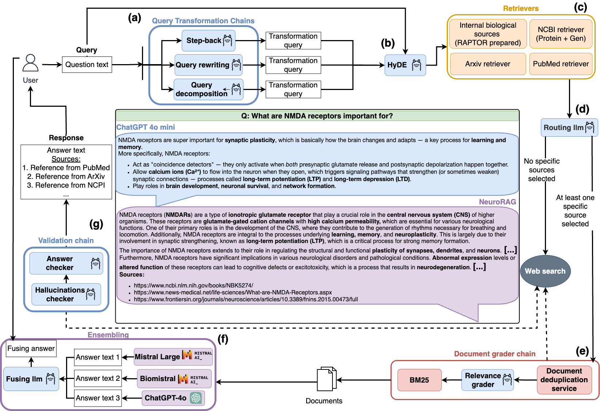

<p align="center"><h1 align="center">NeuroRAG</h1></p>
<p align="center">
	<em>AI Assistant for neurobiologists</em>
	<!--TODO: stament for the paper link (doi) -->
</p>


<p align="center">
    
	 
	<a href="https://huggingface.co/Biomed-imaging-lab-boss/NeuroRAG">
	 
	</a>
	<a href="https://github.com/Biomed-imaging-lab/NeuroRAG">
    
	</a>
	<br>
</p>
	

<div align="center">
<b>Repository statistics:</b>
<p align="center">
	
	
	
	
</p>
</div>

<div align="center">
<b>System requirements:</b>
<p align="center">
	
	
	
</p>
</div>

<div align="center">
<b>Share on social media:</b>
<p align="center">
<!-- Facebook -->
<a href="https://www.facebook.com/sharer/sharer.php?u=https://github.com/Biomed-imaging-lab/NeuroRAG">
	
</a>
<!-- Reddit -->
<a href="https://www.reddit.com/submit?title=Check%20out%20this%20project%20on%20GitHub:%20https://github.com/Biomed-imaging-lab/NeuroRAG">
	
</a>
<!-- LinkedIn -->
<a href="https://www.linkedin.com/shareArticle?url=https://github.com/Biomed-imaging-lab/NeuroRAG&title=NeuroRAG&summary=A Biomedical AI Project&source=GitHub">
	
</a>
<!-- Telegram -->
<a href="https://t.me/share/url?url=https://github.com/Biomed-imaging-lab/NeuroRAG&text=Check out NeuroRAG: A Biomedical AI Project">
	
</a>
<!-- Threads -->
<a href="https://www.threads.net/intent/post?text=Check out NeuroRAG on GitHub: https://github.com/Biomed-imaging-lab/NeuroRAG">
	
</a>
<!-- X (Twitter) -->
<a href="https://twitter.com/intent/tweet?text=Check out NeuroRAG: A Biomedical AI Project&url=https://github.com/Biomed-imaging-lab/NeuroRAG">
	
</a>
<!-- Quora -->
<a href="https://www.quora.com/share?url=https://github.com/Biomed-imaging-lab/NeuroRAG&title=NeuroRAG: A Biomedical AI Project">
	
</a> <br>
<!-- WhatsApp -->
<a href="https://wa.me/?text=Check out NeuroRAG: A Biomedical AI Project on GitHub: https://github.com/Biomed-imaging-lab/NeuroRAG">
	
</a>
<!-- Signal -->
<a href="https://signal.me/#/?text=Check out NeuroRAG on GitHub: https://github.com/Biomed-imaging-lab/NeuroRAG">
	
</a>
<!-- WeChat  -->
<a href="weixin://dl/share?url=https://github.com/Biomed-imaging-lab/NeuroRAG&title=NeuroRAG">
	
</a>
<a href="https://slack.com/intent/tweet?text=Check out NeuroRAG: https://github.com/Biomed-imaging-lab/NeuroRAG">
	
</a>
<a href="https://github.com/sponsors/IMZolin">
	
</a>
</p>
</div>

---


##  Table of Contents

<details closed>

<summary>More details about contents</summary>

- [Table of Contents](#table-of-contents)
- [Overview](#overview)
- [Features](#features)
- [Project Structure](#project-structure)
	- [Project Index](#project-index)
- [Getting Started](#getting-started)
	- [Prerequisites](#prerequisites)
	- [Installation](#installation)
	- [Usage](#usage)
- [Contributing](#contributing)
- [License](#license)
- [Authors](#authors)

</details>

---

##  Overview

NeuroRAG is a cutting-edge open-source project designed to revolutionize language processing in the fields of neurobiology, medicine, and psychology. By seamlessly integrating advanced language models and graph-based operations, NeuroRAG empowers users to effortlessly grade documents, evaluate answers, and rewrite queries for enhanced information retrieval. Ideal for researchers, educators, and AI enthusiasts seeking to unlock the full potential of language processing technologies.

<p align="center">
<figure>
  
  <figcaption>The <b>NeuroRAG</b> system <b>architecture</b>. Diagram shows the multi-agent workflow: <b>query input → routing → retrieval → filtering → ensemble answer generation</b> with multiple LLMs, <b>including hallucination and relevance checks</b>.
  (a) - Query Transformation Chains; (b) - HyDE; (c) - Retrievers; (d) - Routing llm; (e) - Document grader chain; (f) - Ensembling of LLMs; (g) - Validation chain</figcaption>
</figure>
</p>

### Results (evaluation on biomedical datasets in QA task)

<div align="center">

| **Datasets** | **GPT4-o** | **Mistral Large** | **Llama3.3 70B** | **BioMistral** | **NeuroRAG** |
| :------------: | :------------: | :------------: | :------------: | :------------: | :------------: |
| Medical Genetics | 0.9500 | 0.8600 | 0.9400   | 0.9400   |  **0.9600** |
| College Biology   | 0.9167 | 0.9514  |  0.9236   | 0.9306   | **0.9722** |
| College Medicine   | 0.8382 | 0.82664  |  0.7977   | 0.7861   |  **0.8728**|

Accuracy on Biological MMLU Datasets.
</div>

<div align="center">

| **Metrics** | **GPT4-o** | **Mistral Large** | **Llama3.3 70B** | **BioMistral** | **NeuroRAG** |
| :------------: | :------------: | :------------: | :------------: | :------------: | :------------: |
| CosSim | 0.6005 | 0.6008 | 0.6015   | 0.4953   |  **0.6346** |
| BLEU   | **0.0233** | 0.0183  |  0.0122   | 0.0018   | 0.0166 |
| ROUGE-1   | **0.2973** | 0.2963  |  0.2570   | 0.2349    |  0.2738 |
| ROUGE-L   | 0.1601 | 0.1542  |  0.1471   | **0.2082**   |  0.1744 |

Perfromance metrics (Cosine Similarity,  BLEU, ROUGE-1, ROUGE-L) on the MEDIQA Dataset with String Answers.

</div>

---

##  Features

<details closed>

<summary>More details about features</summary>

|      | Feature         | Summary       |
| :--- | :---:           | :---          |
| ⚙️  | **Architecture**  | <ul><li>NeuroRAG utilizes a modular architecture with components such as document processing, retrievers, chains, and answer grading.</li><li>The architecture enables advanced language processing and graph-based operations for tasks like document grading and query rewriting.</li><li>Central hub in `neurorag.py` orchestrates data flow through different modules for seamless integration and operation.</li></ul> |
| 🔩 | **Code Quality**  | <ul><li>Codebase maintains high code quality standards with consistent formatting and linting rules defined in `pyproject.toml`.</li><li>Utilizes essential libraries like `<scikit-learn>`, `<numpy>`, and `<pandas>` for efficient data manipulation and processing.</li><li>Includes detailed documentation within code files to enhance readability and maintainability.</li></ul> |
| 📄 | **Documentation** | <ul><li>Extensive documentation in various formats (e.g., `<ipynb>`, `<py>`) covering dataset generation, model evaluation, and application interfaces.</li><li>Usage of `<pip>` for managing dependencies and providing clear installation instructions in `requirements.txt`.</li><li>Documentation includes detailed explanations of code files and their roles within the project architecture.</li></ul> |
| 🔌 | **Integrations**  | <ul><li>Integrates with external libraries and frameworks like `<langchain>`, `<langgraph>`, and `<langchainhub>` for enhanced language processing capabilities.</li><li>FastAPI endpoint in `api.py` enables seamless integration of NeuroRAG model for answering queries based on pre-loaded documents.</li><li>Utilizes Streamlit chatbot interface in `app.py` for user interaction and content display.</li></ul> |
| 🧩 | **Modularity**    | <ul><li>Project design emphasizes modularity with distinct components like retrievers, chains, and document grading for specific tasks.</li><li>Each chain (e.g., `FusingChain`, `GenerationChain`) encapsulates logic for specific operations, promoting reusability and maintainability.</li><li>Modular approach allows for easy scalability and extension of functionality through additional chains or components.</li></ul> |
| 🧪 | **Testing**       | <ul><li>Testing commands provided in documentation for running tests using `<pytest>` to ensure code functionality and reliability.</li><li>Test files likely exist within the codebase to validate different components and functionalities.</li><li>Test-driven development approach may be employed to maintain code quality and prevent regressions.</li></ul> |
| ⚡️  | **Performance**   | <ul><li>Utilizes advanced language models like `<GPT>`, `<OpenBio>`, and `<Mistral>` for generating responses and enhancing performance.</li><li>Efficient data retrieval and processing mechanisms in chains like `NCBIRetriever` and `HyDEChain` contribute to overall system performance.</li><li>Performance optimization likely implemented through parallel execution and query optimization strategies.</li></ul> |

</details>

---

##  Project Structure

<details closed>

<summary>More details about structure</summary>

```sh
└── NeuroRAG/
    ├── README.md
    ├── apps
    │   ├── .streamlit
    │   ├── api.py
    │   ├── app.py
    │   ├── grades.json
    │   ├── llm-arena.py
    │   └── questions.csv
    ├── datasets
    │   ├── __init__.py
    │   ├── brainscape.csv
    │   ├── brainscape.ipynb
    │   ├── expert_questions.csv
    │   ├── final.csv
    │   ├── final.ipynb
    │   ├── mediqa.csv
    │   ├── mediqa.ipynb
    │   ├── medmcqa.csv
    │   ├── medmcqa.ipynb
    │   ├── mmlu.csv
    │   └── mmlu.ipynb
    ├── documents
    │   ├── Alwyn Scott — Neuroscience: A Mathematical Primer.pdf
    │   ├── Constance Hammond — Cellular and Molecular NeurophysiologyConstance Hammond — Cellular and Molecular NeurophysiologyConstance Hammond — Cellular and Molecular NeurophysiologyConstance Hammond — Cellular and Molecular Neurophysiology.pdf
    │   ├── Dale Purves, George J. Augustine, David Fitzpatrick William C. Hall, Anthony-Samuel Lamantia, James O. McNamara, S. Mark Williams — Neuroscience, Third Edition.pdf
    │   └── Sarah Piper, Abdullah Ahmed — Microscopy for neuroscience research.pdf
    ├── neurorag
    │   ├── __init__.py
    │   ├── chains
    │   ├── neurorag.py
    │   ├── retrievers
    │   └── utils
    ├── notebooks
    │   ├── RAPTOR.ipynb
    │   ├── __init__.py
    │   ├── cosine-evaluation.ipynb
    │   ├── llm-blender.ipynb
    │   ├── mmlu-evaluation.ipynb
    │   ├── mmlu.ipynb
    │   └── raw-llms.ipynb
    ├── pyproject.toml
    └── requirements.txt
```
</details>

###  Project Index
<details open>
	<summary><b><code>NEURORAG/</code></b></summary>
	<details> <!-- __root__ Submodule -->
		<summary><b>__root__</b></summary>
		<blockquote>
			<table>
			<tr>
				<td><b><a href='https://github.com/Biomed-imaging-lab/NeuroRAG/blob/master/requirements.txt'>requirements.txt</a></b></td>
				<td>Manage project dependencies using the provided requirements.txt file to ensure proper functioning of the codebase architecture.</td>
			</tr>
			<tr>
				<td><b><a href='https://github.com/Biomed-imaging-lab/NeuroRAG/blob/master/pyproject.toml'>pyproject.toml</a></b></td>
				<td>Configure code formatting and linting rules in the project using the provided pyproject.toml file.</td>
			</tr>
			</table>
		</blockquote>
	</details>
	<details> <!-- datasets Submodule -->
		<summary><b>datasets</b></summary>
		<blockquote>
			<table>
			<tr>
				<td><b><a href='https://github.com/Biomed-imaging-lab/NeuroRAG/blob/master/datasets/mmlu.ipynb'>mmlu.ipynb</a></b></td>
				<td>- Generates a dataset by aggregating questions and answers from various subsets related to anatomy, biology, medicine, and psychology<br>- The resulting CSV file 'mmlu.csv' contains a comprehensive collection of questions and their corresponding answers for further analysis and processing within the project architecture.</td>
			</tr>
			<tr>
				<td><b><a href='https://github.com/Biomed-imaging-lab/NeuroRAG/blob/master/datasets/medmcqa.ipynb'>medmcqa.ipynb</a></b></td>
				<td>- The code file `medmcqa.ipynb` in the datasets directory of the project is responsible for importing datasets and pandas for data manipulation<br>- It likely plays a role in loading and preprocessing medical multiple-choice question and answer data for further analysis within the project architecture.</td>
			</tr>
			<tr>
				<td><b><a href='https://github.com/Biomed-imaging-lab/NeuroRAG/blob/master/datasets/final.ipynb'>final.ipynb</a></b></td>
				<td>Merge datasets to create a comprehensive final dataset for analysis and export it as a CSV file.</td>
			</tr>
			<tr>
				<td><b><a href='https://github.com/Biomed-imaging-lab/NeuroRAG/blob/master/datasets/mediqa.ipynb'>mediqa.ipynb</a></b></td>
				<td>- The code file `datasets/mediqa.ipynb` in the project architecture integrates datasets and performs data processing tasks using language models and prompts from the Langchain framework<br>- It leverages the Ollama language model system and PromptTemplate for generating outputs related to medical question answering.</td>
			</tr>
			<tr>
				<td><b><a href='https://github.com/Biomed-imaging-lab/NeuroRAG/blob/master/datasets/brainscape.ipynb'>brainscape.ipynb</a></b></td>
				<td>- Extracts data from a website to create a dataset of flashcards related to neurobiology<br>- The code initializes an empty DataFrame, scrapes URLs, extracts flashcard content, and saves the data to a CSV file<br>- This process automates the collection of educational content for further analysis and study.</td>
			</tr>
			</table>
		</blockquote>
	</details>
	<details> <!-- neurorag Submodule -->
		<summary><b>neurorag</b></summary>
		<blockquote>
			<table>
			<tr>
				<td><b><a href='https://github.com/Biomed-imaging-lab/NeuroRAG/blob/master/neurorag/neurorag.py'>neurorag.py</a></b></td>
				<td>- The `neurorag.py` file in the project serves as a central hub for integrating various components such as document processing, embeddings, retrievers, and chains for tasks like document grading, answer grading, and query rewriting<br>- It orchestrates the flow of data and operations through the different modules to enable advanced language processing and graph-based operations within the codebase architecture.</td>
			</tr>
			</table>
			<details>
				<summary><b>retrievers</b></summary>
				<blockquote>
					<table>
					<tr>
						<td><b><a href='https://github.com/Biomed-imaging-lab/NeuroRAG/blob/master/neurorag/retrievers/NCBIRetriever.py'>NCBIRetriever.py</a></b></td>
						<td>- Retrieves and processes gene or protein data from the NCBI database based on a search query<br>- Generates structured documents with relevant information for each gene or protein record fetched.</td>
					</tr>
					</table>
				</blockquote>
			</details>
			<details>
				<summary><b>chains</b></summary>
				<blockquote>
					<table>
					<tr>
						<td><b><a href='https://github.com/Biomed-imaging-lab/NeuroRAG/blob/master/neurorag/chains/fusing.py'>fusing.py</a></b></td>
						<td>- The `FusingChain` class orchestrates the merging of multiple AI-generated responses into a coherent and comprehensive answer<br>- It evaluates, identifies common answers, synthesizes information, and formats the final response in JSON format<br>- By leveraging various components like parsers, prompts, and runnables, it intelligently combines insights from different sources to produce a unified output.</td>
					</tr>
					<tr>
						<td><b><a href='https://github.com/Biomed-imaging-lab/NeuroRAG/blob/master/neurorag/chains/ncbi_protein.py'>ncbi_protein.py</a></b></td>
						<td>- Facilitates transforming user queries into precise NCBI protein database searches<br>- Utilizes Pydantic for schema validation and RetryOutputParser for handling retries<br>- Implements a chain of operations including prompt generation, language model processing, and data retrieval<br>- Enables efficient query optimization for bioinformatics experts.</td>
					</tr>
					<tr>
						<td><b><a href='https://github.com/Biomed-imaging-lab/NeuroRAG/blob/master/neurorag/chains/hyde.py'>hyde.py</a></b></td>
						<td>- Enables generation of scientific paper passages in response to queries by chaining together a prompt, language model, and output parser<br>- The HyDEChain class initializes the chain and provides a method to invoke it with a query, returning the generated passage.</td>
					</tr>
					<tr>
						<td><b><a href='https://github.com/Biomed-imaging-lab/NeuroRAG/blob/master/neurorag/chains/step_back.py'>step_back.py</a></b></td>
						<td>- Generates step-back queries to enhance context retrieval in a RAG system<br>- Utilizes a chain of processes to create broader, more general queries based on the original input<br>- The code orchestrates the flow of operations, including parsing, prompting, and invoking the query generation process.</td>
					</tr>
					<tr>
						<td><b><a href='https://github.com/Biomed-imaging-lab/NeuroRAG/blob/master/neurorag/chains/generation.py'>generation.py</a></b></td>
						<td>- The `GenerationChain` class orchestrates multiple language models to fuse responses for question-answering tasks<br>- It integrates GPT, OpenBio, and Mistral models, combining their outputs to generate a coherent response<br>- The class encapsulates the logic for invoking the models and fusing their responses, providing a streamlined interface for generating answers based on user queries and context.</td>
					</tr>
					<tr>
						<td><b><a href='https://github.com/Biomed-imaging-lab/NeuroRAG/blob/master/neurorag/chains/route.py'>route.py</a></b></td>
						<td>- Defines a RouteChain class that orchestrates retrieval methods for user questions<br>- It leverages Pydantic for data validation and RetryOutputParser for error handling<br>- The class encapsulates a chain of operations, including prompts, language models, and JSON extraction, to process user queries effectively.</td>
					</tr>
					<tr>
						<td><b><a href='https://github.com/Biomed-imaging-lab/NeuroRAG/blob/master/neurorag/chains/json_extractor.py'>json_extractor.py</a></b></td>
						<td>Extracts the last JSON object from input data, removing escape characters.</td>
					</tr>
					<tr>
						<td><b><a href='https://github.com/Biomed-imaging-lab/NeuroRAG/blob/master/neurorag/chains/document_grade.py'>document_grade.py</a></b></td>
						<td>- Implement a document grading chain that assesses document relevance to a user query<br>- Utilizes Pydantic for schema validation and RetryOutputParser for error handling<br>- The chain orchestrates prompts, language models, and JSON extraction to evaluate and assign a binary relevance score ('yes' or 'no') based on keyword and semantic alignment between the query and document.</td>
					</tr>
					<tr>
						<td><b><a href='https://github.com/Biomed-imaging-lab/NeuroRAG/blob/master/neurorag/chains/ncbi_gene.py'>ncbi_gene.py</a></b></td>
						<td>- Facilitates transforming user questions into precise queries for the NCBI gene database<br>- Utilizes a chain of operations to optimize user queries, parse outputs, and retrieve gene loci<br>- The code orchestrates a series of steps to enhance user query effectiveness and streamline database searches.</td>
					</tr>
					<tr>
						<td><b><a href='https://github.com/Biomed-imaging-lab/NeuroRAG/blob/master/neurorag/chains/answer_grade.py'>answer_grade.py</a></b></td>
						<td>- Defines an Answer Grade Chain that assesses if an answer resolves a question<br>- It utilizes a binary scoring system ('yes' or 'no') based on user input and LLM generation<br>- The chain includes a retry mechanism and various parsers for processing the input<br>- The main purpose is to evaluate answers and provide a binary score indicating if the question is addressed.</td>
					</tr>
					<tr>
						<td><b><a href='https://github.com/Biomed-imaging-lab/NeuroRAG/blob/master/neurorag/chains/decomposition.py'>decomposition.py</a></b></td>
						<td>- Facilitates decomposition of complex queries into simpler sub-queries for a RAG system<br>- Parses input query, generates sub-queries, and handles retries for comprehensive responses<br>- Integrates Pydantic for schema validation and prompts for user interaction<br>- Orchestrates parallel execution of components for efficient processing.</td>
					</tr>
					<tr>
						<td><b><a href='https://github.com/Biomed-imaging-lab/NeuroRAG/blob/master/neurorag/chains/query_rewriting.py'>query_rewriting.py</a></b></td>
						<td>- Enables query rewriting for improved information retrieval in a RAG system by reformulating user queries<br>- The code defines a schema for rewritten queries, sets up a prompt template for AI assistants, and constructs a chain for query processing using various components like parsers and extractors<br>- The QueryRewritingChain class facilitates invoking the chain to generate more specific and relevant queries.</td>
					</tr>
					<tr>
						<td><b><a href='https://github.com/Biomed-imaging-lab/NeuroRAG/blob/master/neurorag/chains/hallucinations.py'>hallucinations.py</a></b></td>
						<td>- Facilitates assessing if an LLM answer aligns with facts by providing a binary score<br>- Utilizes a structured template for grading and incorporates Pydantic for parsing<br>- Implements a chain of operations to process input and generate the binary score.</td>
					</tr>
					</table>
				</blockquote>
			</details>
		</blockquote>
	</details>
	<details> <!-- apps Submodule -->
		<summary><b>apps</b></summary>
		<blockquote>
			<table>
			<tr>
				<td><b><a href='https://github.com/Biomed-imaging-lab/NeuroRAG/blob/master/apps/grades.json'>grades.json</a></b></td>
				<td>- Summarize the purpose and use of the `apps/grades.json` file in the project architecture, focusing on its role in storing detailed information about NMDA receptors, their subunit compositions, and their significance in various physiological and pathological processes<br>- This file serves as a comprehensive reference for understanding the critical functions and importance of NMDA receptors in brain function and neurological disorders.</td>
			</tr>
			<tr>
				<td><b><a href='https://github.com/Biomed-imaging-lab/NeuroRAG/blob/master/apps/llm-arena.py'>llm-arena.py</a></b></td>
				<td>- Generates and saves rankings of answers from neural networks for given questions in the LLM-arena app<br>- Users rank answers by preference, with the option to save rankings for analysis<br>- The code orchestrates the interaction between the neural networks, user interface, and data storage, facilitating user engagement and data collection.</td>
			</tr>
			<tr>
				<td><b><a href='https://github.com/Biomed-imaging-lab/NeuroRAG/blob/master/apps/api.py'>api.py</a></b></td>
				<td>- Implements a FastAPI endpoint for invoking a NeuroRAG model to answer questions based on pre-loaded documents<br>- The code initializes the model with pre-processed documents and handles incoming queries to generate answers.</td>
			</tr>
			<tr>
				<td><b><a href='https://github.com/Biomed-imaging-lab/NeuroRAG/blob/master/apps/app.py'>app.py</a></b></td>
				<td>- The code orchestrates a Streamlit chatbot interface for NeuroRAG, enabling users to interact with the chatbot for assistance<br>- It manages chat messages, user prompts, and responses, along with the display of documents and sources<br>- The interface allows users to engage in conversations with the chatbot, receive generated content, and view relevant documents within the application.</td>
			</tr>
			</table>
			<details>
				<summary><b>.streamlit</b></summary>
				<blockquote>
					<table>
					<tr>
						<td><b><a href='https://github.com/Biomed-imaging-lab/NeuroRAG/blob/master/apps/.streamlit/config.toml'>config.toml</a></b></td>
						<td>Customize the primary color theme for the Streamlit app in the project configuration file located at apps/.streamlit/config.toml.</td>
					</tr>
					</table>
				</blockquote>
			</details>
		</blockquote>
	</details>
	<details> <!-- notebooks Submodule -->
		<summary><b>notebooks</b></summary>
		<blockquote>
			<table>
			<tr>
				<td><b><a href='https://github.com/Biomed-imaging-lab/NeuroRAG/blob/master/notebooks/mmlu.ipynb'>mmlu.ipynb</a></b></td>
				<td>- Summary:
The code file `mmlu.ipynb` in the notebooks directory is dedicated to evaluating language models using the Massive Multitask Language Understanding (MMLU) benchmark<br>- This benchmark assesses language models across a wide range of domains, spanning from fundamental topics like history and mathematics to specialized fields such as law and medicine<br>- The code facilitates the evaluation of language understanding capabilities in diverse subject areas, contributing to the enhancement of language models' performance and applicability across various domains within the project architecture.</td>
			</tr>
			<tr>
				<td><b><a href='https://github.com/Biomed-imaging-lab/NeuroRAG/blob/master/notebooks/raw-llms.ipynb'>raw-llms.ipynb</a></b></td>
				<td>- The code file `raw-llms.ipynb` in the project structure is responsible for importing necessary packages and setting up the initial environment for natural language processing tasks<br>- It handles tasks such as data preprocessing, feature extraction, and evaluation using various libraries like NLTK, NumPy, Pandas, and scikit-learn<br>- This notebook serves as a foundational step in the data processing pipeline of the project, ensuring that the data is ready for further analysis and modeling.</td>
			</tr>
			<tr>
				<td><b><a href='https://github.com/Biomed-imaging-lab/NeuroRAG/blob/master/notebooks/RAPTOR.ipynb'>RAPTOR.ipynb</a></b></td>
				<td>- The code file `RAPTOR.ipynb` in the notebooks directory serves as a key component in the project architecture<br>- It plays a crucial role in leveraging the RAPTOR algorithm to enhance the project's capabilities<br>- This code file facilitates the efficient processing and analysis of data, contributing significantly to the project's overall functionality and performance.</td>
			</tr>
			<tr>
				<td><b><a href='https://github.com/Biomed-imaging-lab/NeuroRAG/blob/master/notebooks/cosine-evaluation.ipynb'>cosine-evaluation.ipynb</a></b></td>
				<td>- The `cosine-evaluation.ipynb` file in the project focuses on evaluating cosine similarity using GraphRAG<br>- It imports necessary packages, processes data, and calculates cosine similarity scores for the project's text data<br>- This evaluation is crucial for understanding the semantic similarity between different text elements within the project's architecture.</td>
			</tr>
			<tr>
				<td><b><a href='https://github.com/Biomed-imaging-lab/NeuroRAG/blob/master/notebooks/llm-blender.ipynb'>llm-blender.ipynb</a></b></td>
				<td>- Summary:
The code file `llm-blender.ipynb` in the `notebooks` directory serves the purpose of importing necessary packages for the project<br>- It ensures that the required dependencies, such as NLTK and NumPy, are already installed and available for use in the project's workflow<br>- This file plays a crucial role in setting up the environment and enabling the project to leverage these essential libraries seamlessly.</td>
			</tr>
			<tr>
				<td><b><a href='https://github.com/Biomed-imaging-lab/NeuroRAG/blob/master/notebooks/mmlu-evaluation.ipynb'>mmlu-evaluation.ipynb</a></b></td>
				<td>- The code file `mmlu-evaluation.ipynb` in the notebooks directory of the project focuses on utilizing the GraphRAG library for evaluating machine learning models<br>- It imports necessary packages, processes data, and likely contains code for model evaluation and analysis<br>- This file plays a crucial role in assessing the performance and effectiveness of machine learning models within the project's architecture.</td>
			</tr>
			</table>
		</blockquote>
	</details>
</details>

---
##  Getting Started

###  Prerequisites

Before getting started with NeuroRAG, ensure your runtime environment meets the following requirements:

- **Programming Language:** Python
- **Package Manager:** Pip


###  Installation

Install NeuroRAG using one of the following methods:

**Build from source:**

1. Clone the NeuroRAG repository:
```sh
❯ git clone https://github.com/Biomed-imaging-lab/NeuroRAG
```

2. Navigate to the project directory:
```sh
❯ cd NeuroRAG
```

3. Install the project dependencies:


**Using `pip`** &nbsp; [](https://pypi.org/project/pip/)

```sh
❯ pip install -r requirements.txt
```

###  Usage
Run NeuroRAG streamlit app using the following command:

```sh
❯ docker build -t neurorag-app .
```

```sh
❯ docker run -p 8501:8501 --add-host=host.docker.internal:host-gateway -e HTTP_PROXY="http://host.docker.internal:2080" -e HTTPS_PROXY="http://host.docker.internal:2080" -e OLLAMA_HOST="http://host.docker.internal:11434" -e NO_PROXY="localhost,127.0.0.1,host.docker.internal" neurorag-app
```

---

##  Contributing

- **💬 [Join the Discussions](https://github.com/Biomed-imaging-lab/NeuroRAG/discussions)**: Share your insights, provide feedback, or ask questions.
- **🐛 [Report Issues](https://github.com/Biomed-imaging-lab/NeuroRAG/issues)**: Submit bugs found or log feature requests for the `NeuroRAG` project.
- **💡 [Submit Pull Requests](https://github.com/Biomed-imaging-lab/NeuroRAG/blob/main/CONTRIBUTING.md)**: Review open PRs, and submit your own PRs.

<details closed>
<summary>Contributing Guidelines</summary>

1. **Fork the Repository**: Start by forking the project repository to your github account.
2. **Clone Locally**: Clone the forked repository to your local machine using a git client.
   ```sh
   git clone https://github.com/Biomed-imaging-lab/NeuroRAG
   ```
3. **Create a New Branch**: Always work on a new branch, giving it a descriptive name.
   ```sh
   git checkout -b new-feature-x
   ```
4. **Make Your Changes**: Develop and test your changes locally.
5. **Commit Your Changes**: Commit with a clear message describing your updates.
   ```sh
   git commit -m 'Implemented new feature x.'
   ```
6. **Push to github**: Push the changes to your forked repository.
   ```sh
   git push origin new-feature-x
   ```
7. **Submit a Pull Request**: Create a PR against the original project repository. Clearly describe the changes and their motivations.
8. **Review**: Once your PR is reviewed and approved, it will be merged into the main branch. Congratulations on your contribution!
</details>

<details closed>
<summary>Contributor Graph</summary>
<br>
<p align="left">
   <a href="https://github.com{/Biomed-imaging-lab/NeuroRAG/}graphs/contributors">
      
   </a>
</p>
</details>

---

##  License

This project is protected under the Apache License 2.0 License. For more details, refer to the [LICENSE](https://choosealicense.com/licenses/) file.

---

## Authors

**Vladimir Skvortsov**<sup>1</sup>, **Ivan Zolin**<sup>1, 2</sup>, **Vyacheslav Chukanov**<sup>1</sup>, **Ekaterina Pchitskaya**<sup>1</sup>

1. Laboratory of Biomedical Imaging and Data Analysis, Institute of Biomedical Systems and Biotechnology, Peter the Great St. Petersburg Polytechnic University  
2. ITMO University  
